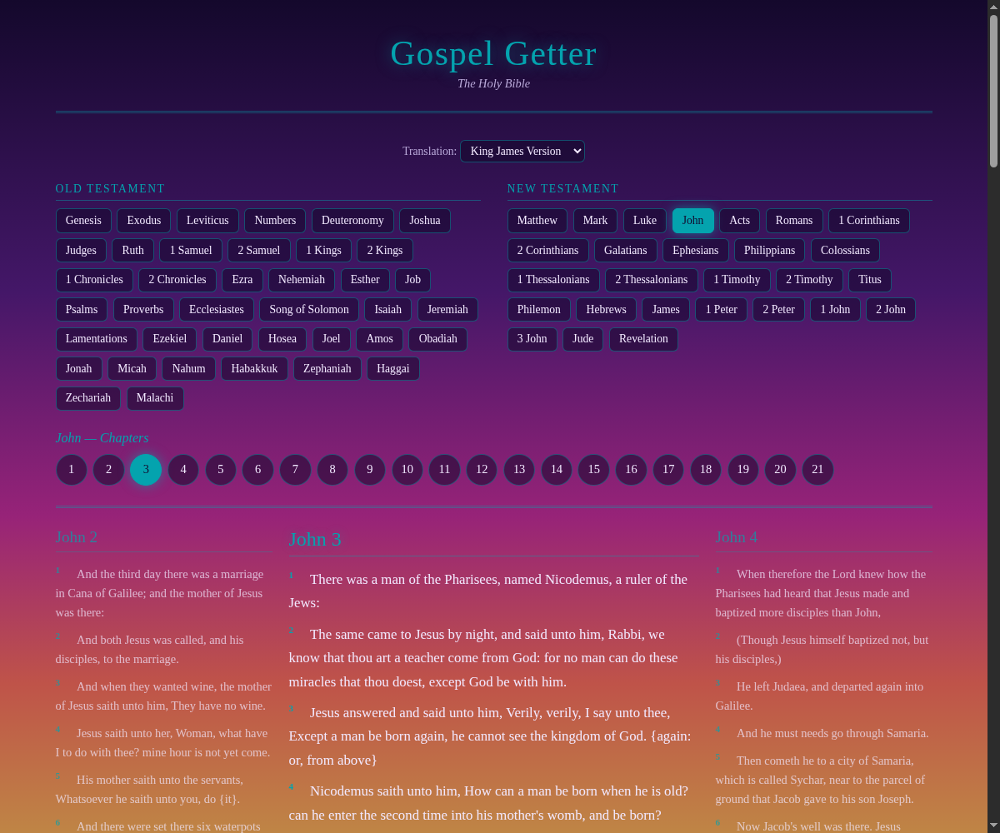
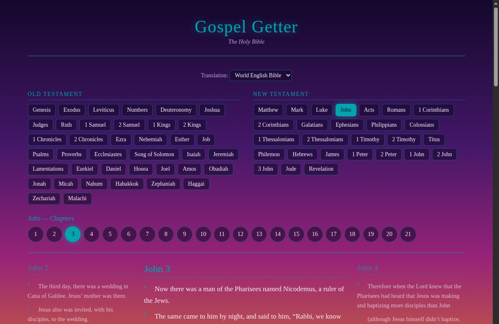
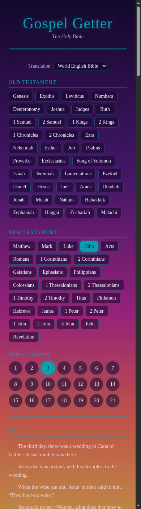

# Gospel Getter

[](https://github.com/tossbaws/gospel-getter/actions/workflows/ci.yml)
[](LICENSE)

A Bible reader with a vaporwave soul: browse all 66 books, pick a chapter,
and read — with the chapter before and after it shown in full, at reduced
opacity, to the left and right of the one you're reading, scrolling along
with you as one continuous page.



## Features

- Two full translations (KJV and WEB) are bundled right into the binary —
  no network access or API keys needed, it just works offline.
- The chapter before and after the one you're reading is shown in full,
  faded a bit, right alongside it, and scrolls with you instead of living
  behind a "next page" click.
- Arrow keys move you through the whole Bible a chapter at a time,
  correctly crossing book boundaries (Genesis 50 into Exodus 1, and so on)
  so you never have to touch the mouse.
- It remembers where you left off — close it and reopen it and you're back
  on the same chapter and translation.
- A real native desktop app (built with Tauri): no browser, no background
  server, no open port — just a window with its own taskbar icon.

## Screenshots

| Reading with translation switching | Responsive on narrow screens |
|---|---|
|  |  |

## Running it

```bash
cd src-tauri
cargo tauri dev
```

Opens straight into a native window — nothing to browse to.

## Installing as a desktop app

`packaging/install.sh` builds a release AppImage (via `cargo tauri build`)
and drops a `.desktop` launcher and icon into the usual per-user
locations, so Gospel Getter shows up as a normal app in your launcher. See
`packaging/` for details; `packaging/uninstall.sh` undoes it.

It's also how you update — after a code change, just run it again. It
rebuilds the AppImage and reinstalls it in place; running it again when
nothing's changed just gives you the same build back.

Bundled Bible data only ever gets added to, not overwritten. Adding a
translation to `TRANSLATIONS` and reinstalling seeds just that new one
into your existing database — it checks by translation code what's
actually missing, not just whether the database is empty. Fixing a typo
in a translation that's already seeded won't reach an existing install on
its own; you'd need to clear that translation's rows (or the whole
database — see "Where your data lives" below) so it re-seeds.

### Where your data lives

The app's database (translations, cross-references, reading position)
lives in the platform's standard per-app data directory — on Linux,
`~/.local/share/com.tossbaws.gospel-getter/gospel_getter.db`.

If you're upgrading from the old browser-based version of Gospel Getter
(the one that ran a local server at `localhost:3002`), the first launch
of the new app copies your existing database from its old location,
`~/.local/share/gospel-getter/data/gospel_getter.db`, into the new one —
your reading position and everything else carries over automatically.
That copy is one-way and non-destructive: the old file is left exactly
where it was, untouched, so nothing is lost even if something goes wrong.
It's safe to delete once you've confirmed the new app has everything you
expect.

## Navigating

- The books list is always visible — click a book to jump to its first
  chapter (and bring up its chapter grid if you want a different one),
  then click a chapter number to read that one.
- Arrow keys (&larr; / &rarr;) move one chapter at a time through the whole
  Bible, crossing book boundaries as needed (the end of Genesis leads into
  the start of Exodus), same as clicking the previous/next chapter's
  heading in the faded side columns.
- The translation dropdown switches translations for whatever you're
  currently reading, and remembers your choice across visits.

## Translations

Bundled: King James Version (`kjv`) and World English Bible (`web`) — both
public domain, so both are embedded in the binary like everything else, no
API key or network access needed.

NIV and ESV aren't included, and that's deliberate:

- NIV has no free API or downloadable text. Real access goes through
  API.Bible and starts around $10/month per translation for commercial
  use, and the free tier excludes NIV outright.
- ESV has a free API (`api.esv.org`, non-commercial), but its terms cap
  cached/downloaded text at 500 verses, and no more than half of any one
  book — it can't be bundled offline the way KJV and WEB are. Supporting
  it would mean a second translation module type: a live API call per
  request, with a reader-supplied API key, instead of an embedded one.

### Adding a new translation

For anything with a compatible license (public domain, or terms that
permit an offline/bulk copy):

1. Build a JSON file shaped like `src-tauri/data/kjv.json` — an array of 66
   objects, `{"name": "...", "testament": "OT"|"NT", "chapters": [[verse, verse, ...], ...]}`,
   in canonical Genesis-to-Revelation order.
2. Drop it in `src-tauri/data/`.
3. Add one entry to the `TRANSLATIONS` list in `src-tauri/src/db/seed.rs`
   (`code`, `name`, `include_str!(...)` for the new file).

That's it — the seed step, schema, and translation picker all pick it up
automatically. A translation that can only be accessed live, like ESV,
would need some translation-specific fetch code instead of just a data
file. Nobody's built that yet, since neither bundled translation needs it.

## How it's put together

- A Tauri 2 desktop app: `src-tauri/` is the Rust backend (`sqlx`/SQLite),
  `ui/` is a single static `index.html` — plain HTML/CSS/JS, no framework
  and no Node build step. The frontend calls a handful of typed Tauri
  commands (`get_home`, `get_chapters`, `get_reading`, `get_xref_text`)
  instead of making HTTP requests; there's no server and nothing listens
  on a port.
- `books` (name/testament/chapter count) is shared across translations,
  but `verses` is keyed by `(translation_id, book_id, chapter, verse)`, so
  each translation has its own verse text and its own verse counts per
  chapter. Translations occasionally split or number a verse differently —
  chapter counts line up across KJV and WEB, but individual verse counts
  don't always, and that's expected, not a bug.
- `src-tauri/src/domain/bible.rs` holds the only interesting logic:
  computing the chapter before and after any given one, crossing book
  boundaries as needed. It's pure, unit-tested without touching a
  database, and doesn't care which translation is selected.
- The reading pane (current chapter plus its faded neighbors) is built
  from one command, `get_reading`, and rendered by one function in
  `ui/index.html` — used both on startup and for every chapter click,
  arrow key press, and translation switch — so there's exactly one code
  path for putting a chapter on screen.

## Data provenance and textual integrity

No verse text is ever altered, cleaned up, or "corrected" here — both
translations are stored exactly as their source provides them.

- KJV comes from a public-domain JSON dataset, thiagobodruk/bible. That
  source renders the KJV's translator-supplied-word italics and
  Hebrew/Greek marginal notes inline as `{...}` groups, affecting roughly
  56% of verses, and that's preserved verbatim, braces and all — including
  the handful of spots where the source's own markup is broken (Hebrews
  10:34 has a stray unmatched `}` in the upstream data, and it stays that
  way rather than getting "fixed"). The only changes made are non-textual:
  stripping the file's UTF-8 BOM and reshaping the JSON into this app's
  schema — splitting it into book/testament/chapters, a restructuring of
  the container, not the verse text inside it.
- WEB comes from TehShrike/world-english-bible (public domain, via
  ebible.org), one file per book. The only transformation is reassembling
  verse fragments the source itself splits across multiple entries —
  needed for poetic books like Psalms, where one verse is often several
  "line" entries — joined in the source's own order, with nothing added,
  removed, or reworded.

## License

[MIT](LICENSE).
