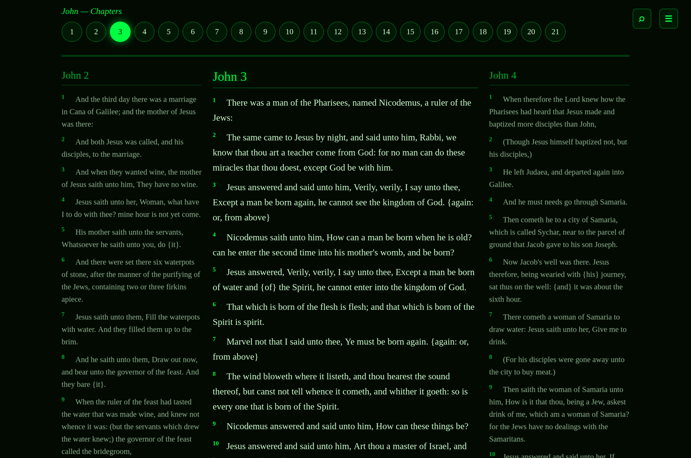
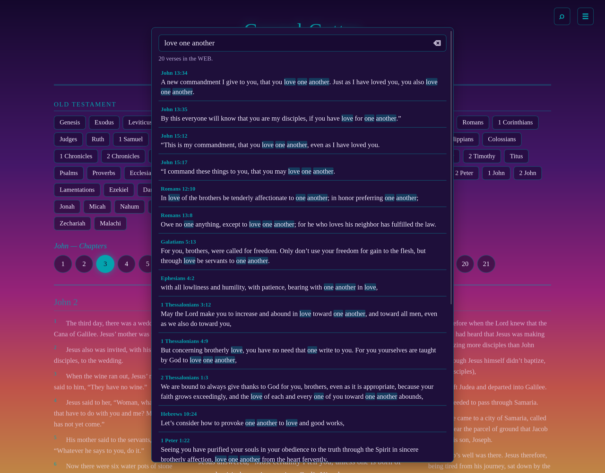
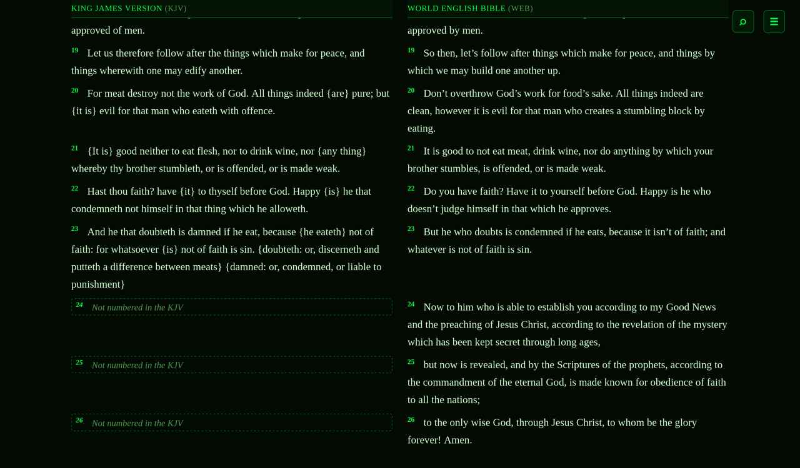
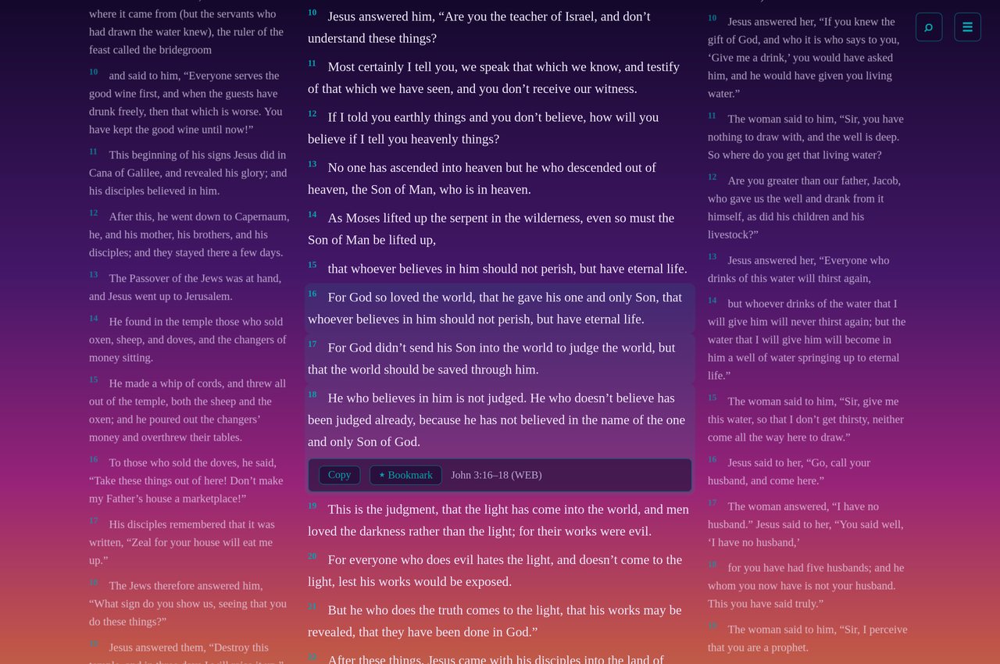
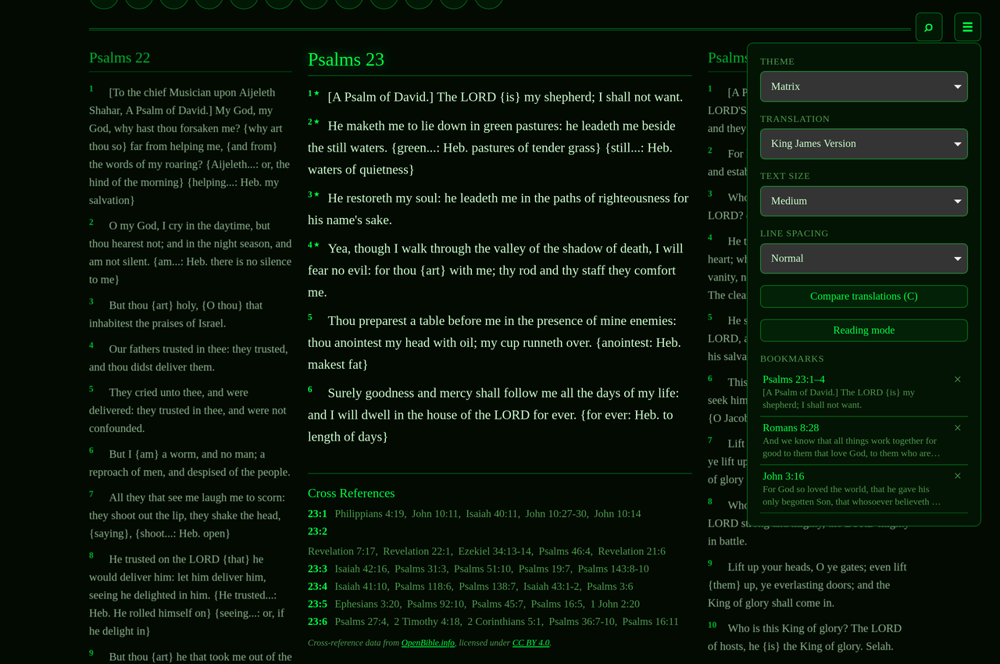

# Gospel Getter

[](https://github.com/tossbaws/gospel-getter/actions/workflows/ci.yml)
[](https://github.com/tossbaws/gospel-getter/actions/workflows/dist.yml)
[](LICENSE)

An offline Bible reader for Linux and Windows. Read the KJV or WEB a chapter
at a time with the chapters before and after shown alongside, search the
whole Bible, compare the two translations verse by verse, and copy or
bookmark passages. No account and no network needed.



## Features

- **Two complete translations, fully offline.** The King James Version and
  World English Bible are built into the app, so there are no downloads,
  API keys or network access.
- **Read in context.** The chapter you're reading sits in the middle with
  the previous and next chapters faded on either side, scrolling with it.
  ← and → turn chapters across the whole Bible, from Genesis 50 into
  Exodus 1 and so on. Or pick a book and chapter, or try **Random chapter**.
- **Search and go to a reference.** One search box (`/` or Ctrl+K) jumps to
  references such as `John 3:16`, `jn 3:16-18`, `1 Cor 13` or `Psalm 23`,
  and searches the text for anything else. Results show every verse in the
  current translation containing all your words, in Bible order, with the
  words highlighted.
- **Copy verses with their reference.** Click a verse, Shift-click another
  to select a range, then **Copy** or Ctrl+C. You get the text exactly as
  stored, followed by e.g. `— John 3:16–18 (WEB)`.
- **Bookmarks.** Save a verse or range with **★ Bookmark**. Bookmarked
  verses get a ★, and the list in settings reopens any of them in
  whichever translation you're reading.
- **Compare translations.** Press `C` to see KJV and WEB side by side, one
  row per verse number. Where only one translation numbers a verse, the
  other column says so instead of shifting anything.
- **Cross-references.** Click a verse to see related passages, and click a
  citation to read it in place.
- **Comfortable reading.** Six themes (Vaporwave, Classic Dark, Classic
  Light, Matrix, Beast Slayer, Hot Pink), four text sizes, three line
  spacings, and a distraction-free reading mode. Printing is always black
  on white.
- **Picks up where you left off.** Your chapter, translation, bookmarks and
  display settings are remembered between sessions.
- **A native desktop app.** Built with Tauri: no browser, no background
  server, nothing listening on a port.

## A quick tour

**Search the text, or jump straight to a reference.** Matching words are
highlighted, and clicking a result opens and selects that verse.



**Compare the KJV and WEB verse by verse.** In Romans 14 the WEB numbers
three verses the KJV doesn't, and the KJV column says so rather than
shifting anything.



**Select a range and copy it with its reference.** The citation underneath
shows exactly what will be copied.



**Bookmark passages and come back to them.** Bookmarked verses are starred
in the text, and the list in settings shows each one with a preview.



## Keyboard

| Key | Does |
|---|---|
| ← / → | Previous / next chapter, across books |
| `/` or Ctrl+K | Open search. Enter goes to a reference; ↓ / ↑ move through results |
| Ctrl+C | Copy the selected verses with their reference. If you've highlighted text yourself, that's copied instead, as usual |
| `C` | Compare translations on/off |
| Shift-click | Extend the selection to a range within the chapter |
| Esc | Close search or settings, then clear the selection, then leave reading mode |

## Installing

**Download** an installer from the
[Releases page](https://github.com/tossbaws/gospel-getter/releases). Each
release lists a `SHA256SUMS` file to check them with.

- **Linux:** an AppImage (most distros, nothing to install) or a `.deb`
  (Debian/Ubuntu).
- **Windows:** the NSIS `setup.exe` (recommended) or an MSI. **The Windows
  installers aren't code-signed**, so SmartScreen will probably warn about
  an "unknown publisher". Choose "More info → Run anyway".

**Build and install it yourself (Linux).** `packaging/install.sh` builds a
release AppImage and adds a launcher and icon to your desktop.
`packaging/uninstall.sh` removes them. Rerun `install.sh` to update after
changing the code. You'll need Rust and the Tauri CLI
(`cargo install tauri-cli --version "^2.0.0" --locked`).

**Run from source.** `cd src-tauri && cargo tauri dev`.

**Arch Linux.** `packaging/PKGBUILD` is a draft. It hasn't been tested with
`makepkg` and is **not published to the AUR**; the file lists what's left
to do.

Every push to `main` also builds untagged installers as
[workflow artifacts](https://github.com/tossbaws/gospel-getter/actions/workflows/dist.yml).
These expire after a while, so use a release unless you want a specific
`main` build.

## Your data

- Everything (translations, cross-references, reading position, bookmarks
  and the search index) lives in one SQLite database in the per-app data
  folder. On Linux that's
  `~/.local/share/com.tossbaws.gospel-getter/gospel_getter.db`; on Windows
  it's under `%APPDATA%\com.tossbaws.gospel-getter\`.
- **Upgrades keep your data.** A new version adds any new tables and builds
  the search index once, in the background, without changing scripture
  text, your reading position or your bookmarks. Moving back to an older
  version after upgrading hasn't been tested.
- Theme, text size, line spacing, compare and reading mode are display
  settings stored in the app's web storage, not the database.
- Coming from the old browser-based Gospel Getter (the local server on
  `localhost:3002`)? The first launch copies its database from
  `~/.local/share/gospel-getter/data/gospel_getter.db` and leaves the
  original untouched.

## Translations

Both bundled translations are public domain, which is what allows them to
ship offline. Copyrighted translations such as the NIV and ESV aren't
bundled; including one would need a licence that permits an offline copy.

**Adding a translation** with a licence that allows an offline copy:

1. Add a JSON file to `src-tauri/data/` shaped like `kjv.json`: 66 books in
   canonical order, each `{"name", "testament", "chapters": [[verse, ...], ...]}`.
2. Add an entry to `TRANSLATIONS` in `src-tauri/src/db/seed.rs`.

Existing installs seed only translations they don't already have. To
correct the text of one that's already seeded, clear its rows (or the
whole database) so it seeds again.

## How it's put together

- **Two parts:** `src-tauri/` is the Rust backend (Tauri 2, `sqlx`/SQLite),
  and `ui/index.html` is the whole frontend in plain HTML, CSS and
  JavaScript, with no framework or build step. The frontend calls typed
  Tauri commands, not HTTP.
- **Data model:** book structure is shared between translations, but each
  translation keeps its own verse text and numbering. KJV and WEB number a
  few verses differently, which is expected.
- **Logic:** `domain/bible.rs` works out the previous and next chapter, and
  `domain/query.rs` decides whether search input is a reference or words.
- **Search:** uses an SQLite FTS5 index derived from `verses`. It's never
  written back, and results always show the stored text.
- **Copying:** uses the webview's own clipboard API, with no plugin or extra
  permission.

## Tests

```bash
# From the repository root; each line runs on its own.
(cd src-tauri && cargo test)                   # backend: database, upgrades, search, references
(cd tests/frontend && npm ci && npm test)      # frontend behavior
```

The frontend tests load the real `ui/index.html` into jsdom and answer its
calls with the app's real command code and a throwaway database, through a
test-only bridge (`src-tauri/examples/frontend_bridge.rs`). CI runs both,
plus `cargo fmt` and Clippy.

## Data provenance and textual integrity

No verse text is altered, cleaned up or "corrected"; both translations are
stored exactly as their sources provide them.

- **KJV** comes from the public-domain dataset thiagobodruk/bible. That
  source marks translator-supplied words and marginal notes inline as
  `{...}`, in about 56% of verses. These are kept verbatim, including a
  few places where the source's own markup is broken (Hebrews 10:34 has an
  unmatched `}`). The only changes are structural: removing the file's
  byte-order mark and reshaping the JSON.
- **WEB** comes from TehShrike/world-english-bible (public domain, via
  ebible.org). Verses the source splits into several entries, as in the
  Psalms' poetry, are joined back together in the source's own order, with
  nothing added, removed or reworded.

Cross-references are from [OpenBible.info](https://www.openbible.info/labs/cross-references/)
under [CC BY 4.0](https://creativecommons.org/licenses/by/4.0/).

## License

[MIT](LICENSE).
